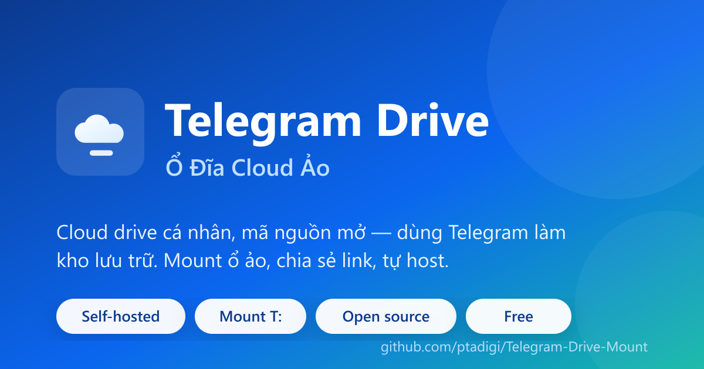
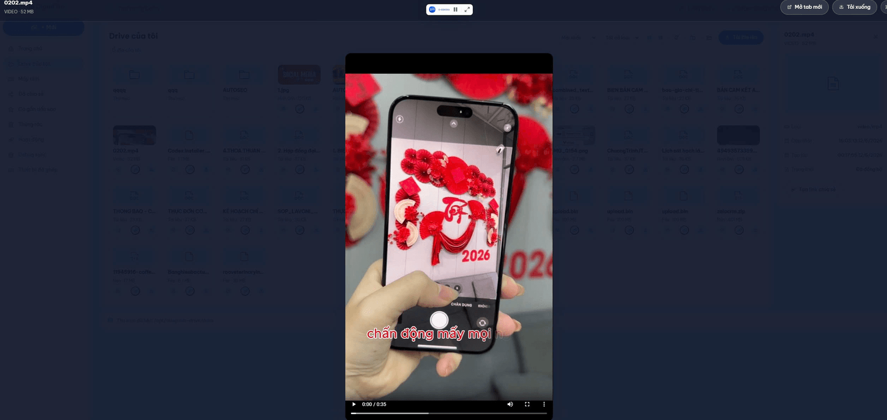
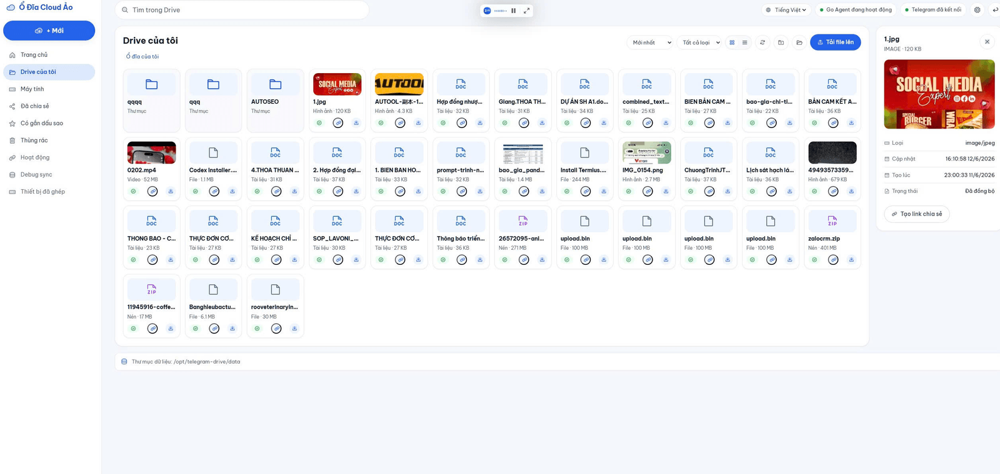
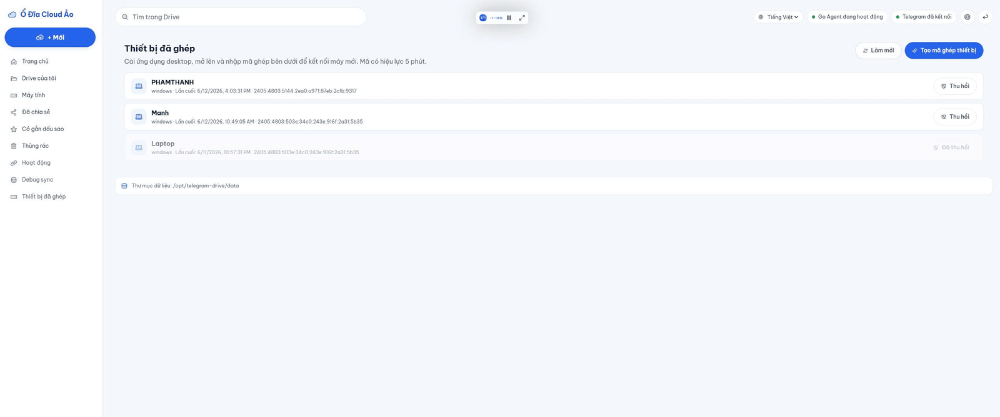

<div align="center">

# ☁️ Ổ Đĩa Cloud Ảo — Telegram Drive

**Cloud drive cá nhân, mã nguồn mở — dùng Telegram làm kho lưu trữ ẩn phía sau.**

Giao diện như Google Drive, mount ổ ảo `T:` trên máy tính, chia sẻ link an toàn — tất cả tự host trên VPS của bạn, dữ liệu thuộc về bạn.

[](https://github.com/ptadigi/Telegram-Drive-Mount/releases/latest)
[](LICENSE)


[Cài đặt](#-cài-đặt-nhanh-1-click) · [Tính năng](#-tính-năng) · [Ảnh giao diện](#-ảnh-giao-diện) · [Tài liệu](#-tài-liệu) · [Đóng góp](CONTRIBUTING.md)

<br/>



</div>

```text
PWA tiếng Việt  ─▶  td-agent (Go)  ─▶  Telegram (storage)
                     │
                  Mount T:  +  Share link  +  Đa thiết bị
```

> **Telegram là kho lưu trữ, không phải giao diện.** Người dùng thao tác như một ổ đĩa cloud; Telegram ẩn hoàn toàn phía sau.

---

## ⚡ Cài đặt nhanh (1-click)

Cần trước: `api_id` và `api_hash` Telegram (miễn phí tại [my.telegram.org](https://my.telegram.org) → *API development tools*).

### 🪟 Windows (máy cá nhân — mount ổ T:)
```powershell
irm https://raw.githubusercontent.com/ptadigi/Telegram-Drive-Mount/main/deploy/install.ps1 | iex
```
Tự tải `TelegramDriveSetup.exe`, xác minh checksum, cài kèm WinFsp + giao diện + icon tray. Hoặc tải thủ công tại [Releases](https://github.com/ptadigi/Telegram-Drive-Mount/releases/latest).

### 🐧 Linux / VPS (máy chủ — Ubuntu, Debian, CentOS, cPanel…)
```bash
curl -fsSL https://raw.githubusercontent.com/ptadigi/Telegram-Drive-Mount/main/deploy/install.sh | sudo bash
```
Tải binary, cài systemd service `td-agent`, hỏi cấu hình, bật chạy nền. Xong → mở `http://<ip-vps>:8750`.

### 🐳 Docker (mọi nền tảng có Docker)
```bash
curl -fsSL https://raw.githubusercontent.com/ptadigi/Telegram-Drive-Mount/main/deploy/install-docker.sh | bash
```

📖 Hướng dẫn chi tiết cho từng môi trường (Windows / Linux / cPanel/aaPanel/1Panel / Docker / domain + HTTPS): **[docs/INSTALL.md](docs/INSTALL.md)**

---

## ✨ Tính năng

**Lưu trữ & Drive**
- Telegram làm object storage; metadata SQLite, tách UX khỏi giới hạn Telegram.
- Cây thư mục, đổi tên/di chuyển/xóa (thùng rác), đánh dấu sao, tìm kiếm.
- Đăng nhập Telegram bằng QR hoặc số điện thoại (hỗ trợ 2FA).

**Upload mạnh mẽ**
- Hàng đợi đa luồng; upload chunk có resume (giao thức tus) cho file lớn, vượt giới hạn reverse proxy.
- Kéo-thả thư mục hàng chục nghìn file mà không treo trình duyệt (streaming theo lô).
- Web Share Target: chia sẻ file từ điện thoại thẳng vào PWA.

**Xem file trong trình duyệt**
- Ảnh (zoom/pan), video & audio (stream + tua), PDF, văn bản, và **docx** (render nội dung).
- Thumbnail màu theo định dạng (ảnh, video, PDF).

**Mount ổ ảo**
- WinFsp (Windows) / FUSE (Linux/macOS), ổ `T:` "Telegram Drive".

**Đa thiết bị**
- Một server giữ session + dữ liệu; máy khác chạy thin-client `--remote` mount qua HTTPS, ghép bằng mã pairing.

**Chia sẻ link**
- Public / mật khẩu / hết hạn / giới hạn lượt tải / thu hồi.
- Trang chia sẻ xem trực tiếp (ảnh/video/pdf/docx) + tải về.

**Bảo mật**
- Tài khoản PWA (bcrypt), session token hash, phân tách dữ liệu theo người dùng, Basic Auth tùy chọn.
- Session Telegram mã hóa AES-256 tại chỗ — không gửi đi đâu.

---

## 📸 Ảnh giao diện

<!-- Bổ sung ảnh vào docs/screenshots/ theo tên dưới đây. Xem docs/screenshots/README.md. -->
<table>
  <tr>
    <td width="50%"><br/><sub>Dashboard — số liệu tệp/thư mục/dung lượng</sub></td>
    <td width="50%"><br/><sub>Drive — lưới file, icon màu theo định dạng</sub></td>
  </tr>
  <tr>
    <td width="50%"><br/><sub>Xem file trong app (ảnh/video/docx)</sub></td>
    <td width="50%"><br/><sub>Chia sẻ link an toàn + trang xem công khai</sub></td>
  </tr>
</table>

> Ảnh chưa hiển thị? Xem [docs/screenshots/README.md](docs/screenshots/README.md) để biết tên file cần bổ sung.

---

## 🚀 Bắt đầu sau khi cài

1. Mở giao diện (Windows: chuột phải icon tray → *Mở giao diện*; Linux: `http://<ip>:8750`).
2. Tạo tài khoản quản trị, đăng nhập Telegram (QR hoặc số điện thoại).
3. Upload file, tạo thư mục, chia sẻ link.
4. (Tùy chọn) Cài app desktop trên máy cá nhân → nối tới server bằng URL + mã ghép → có ổ `T:`.

Đặt domain + HTTPS cho production: xem [docs/INSTALL.md §5](docs/INSTALL.md).

---

## 🏗️ Kiến trúc (rút gọn)

| Thành phần | Vai trò |
|------------|---------|
| `agent-go/` | Backend Go: API, đồng bộ Telegram, VFS/mount, tray, SQLite, cache |
| `web-pwa/` | PWA React + Vite + TypeScript (UI tiếng Việt) |
| `deploy/` | docker-compose, systemd, script cài 1-click |
| `installer/` | Inno Setup đóng gói installer Windows |

Chi tiết: **[docs/system-architecture.md](docs/system-architecture.md)**.

---

## 🛠️ Phát triển từ mã nguồn

Yêu cầu: **Go 1.23+**, **Node.js 20+**.

```bash
# Backend
cd agent-go
$env:TD_AGENT_CONFIG = 'config.local.json'   # PowerShell; bash: export TD_AGENT_CONFIG=...
go run ./cmd/agent
# Health: curl http://127.0.0.1:8750/health

# Frontend (terminal khác)
cd web-pwa
npm install
npm run dev -- --host 0.0.0.0   # mở http://<ip-lan>:5173
```

`config.local.json` chứa Telegram `api_id`/`api_hash` — **không commit**. Build có mount + tray: `go build -tags "fuse tray" ./cmd/agent`.

Quy ước code & đóng góp: **[docs/code-standards.md](docs/code-standards.md)** · **[CONTRIBUTING.md](CONTRIBUTING.md)**.

---

## 📚 Tài liệu

| Tài liệu | Nội dung |
|----------|----------|
| [docs/INSTALL.md](docs/INSTALL.md) | Cài đặt mọi môi trường + 1-click |
| [docs/project-overview-pdr.md](docs/project-overview-pdr.md) | Tổng quan sản phẩm & PDR |
| [docs/system-architecture.md](docs/system-architecture.md) | Kiến trúc hệ thống |
| [docs/codebase-summary.md](docs/codebase-summary.md) | Tổng quan mã nguồn |
| [docs/code-standards.md](docs/code-standards.md) | Quy ước viết mã |
| [docs/DEPLOY.md](docs/DEPLOY.md) | Triển khai VPS, reverse proxy, cache, backup |
| [docs/TROUBLESHOOTING.md](docs/TROUBLESHOOTING.md) | Xử lý sự cố thực tế |
| [docs/CODE_SIGNING.md](docs/CODE_SIGNING.md) | Ký số & xác minh checksum |
| [CHANGELOG.md](CHANGELOG.md) | Lịch sử phiên bản |

---

## 🔒 Xác minh bản tải về

Mỗi release kèm `SHA256SUMS.txt`:

```powershell
# Windows
certutil -hashfile TelegramDriveSetup.exe SHA256
```
```bash
# Linux
sha256sum td-agent-linux-amd64
```
So sánh với dòng tương ứng trong `SHA256SUMS.txt`. Bản hiện tự ký nên Windows SmartScreen có thể báo "Unknown publisher" → *More info → Run anyway*. Xem [docs/CODE_SIGNING.md](docs/CODE_SIGNING.md).

---

## 🤝 Đóng góp & Giấy phép

Issue và Pull Request luôn được hoan nghênh — xem [CONTRIBUTING.md](CONTRIBUTING.md). Phát hành theo [LICENSE](LICENSE).

> ⚠️ Dự án dùng Telegram làm nơi lưu trữ cá nhân; hãy tuân thủ Điều khoản dịch vụ của Telegram và quy định pháp luật nơi bạn sử dụng.

<div align="center">

Made with ☁️ by the community · **Innonet Agency**

</div>
